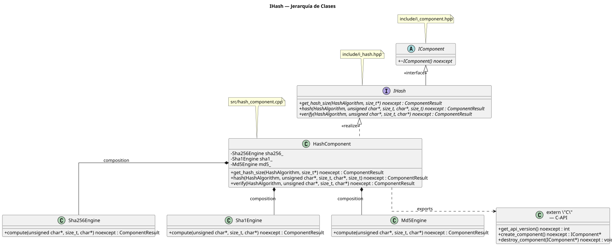
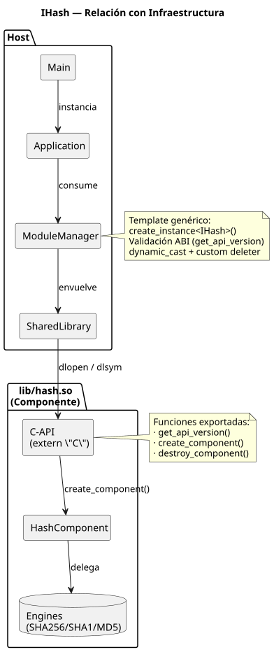
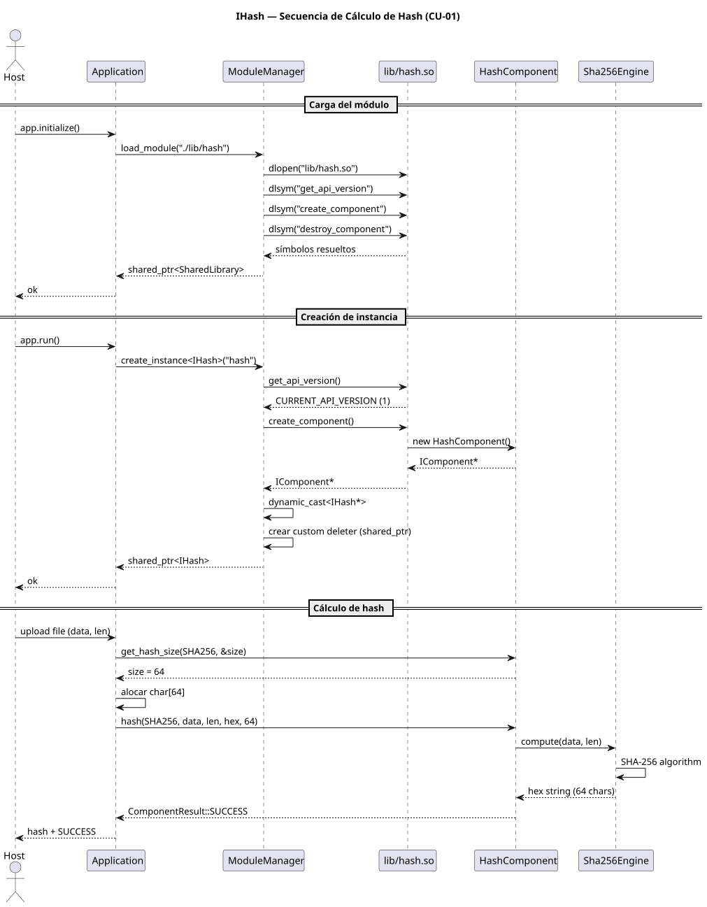
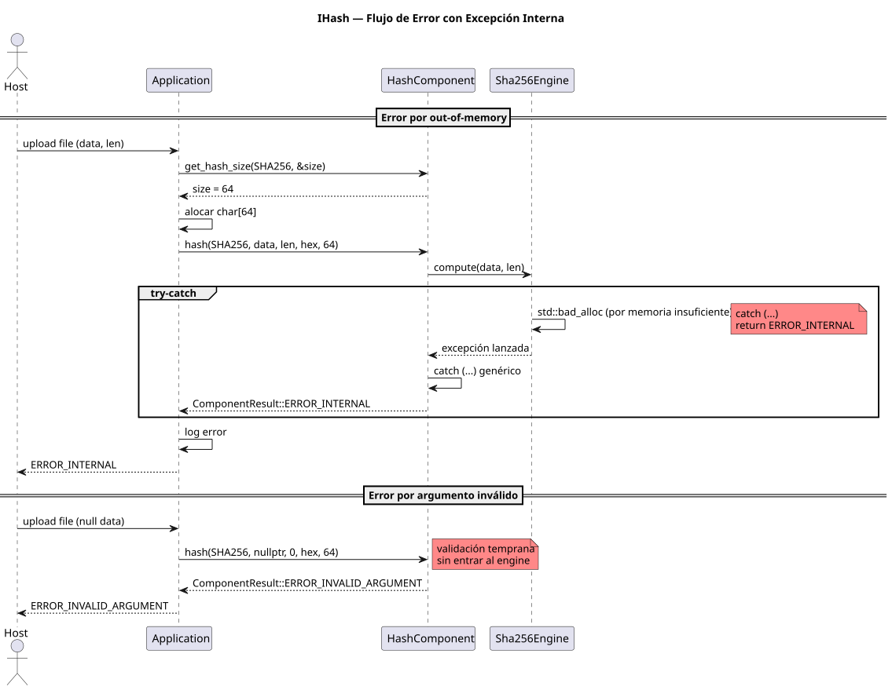

# IHash Component Specification

> Version 1.0 — Análisis y Diseño del Componente Hash

---

## 1. Propósito

El componente `IHash` provee servicios de hashing criptográfico (checksum) al sistema. Dentro del ecosistema del `cpp-component-model`, su objetivo concreto es aportar integridad y detección de duplicados al servidor de contenido educativo **Intraned** (`examples/intraned/`).

### Problema que resuelve

Intraned permite subir archivos (PDF, EPUB, MP3, imágenes) como recursos educativos. El sistema actual almacena estos archivos en disco y registra metadatos en SQLite, pero **no verifica si el mismo archivo ya fue subido antes** ni puede detectar corrupción accidental del binario. Sin un checksum:

- El mismo PDF puede subirse múltiples veces → duplicados en disco y en catálogo.
- Un archivo dañado por corrupción de almacenamiento no puede ser identificado como tal.
- El sistema no tiene trazabilidad de integridad sobre los recursos que sirve.

### Funcionalidad que aporta

| Capacidad | Beneficio |
|---|---|
| Cálculo de hash (MD5, SHA-1, SHA-256) | Permite comparar archivos por contenido, no por nombre |
| Verificación contra hash esperado | Detecta corrupción en recursos almacenados |
| Consulta de tamaño de hash por algoritmo | El Host aloca la cantidad exacta de memoria necesaria |

---

## 2. Casos de Uso

### CU-01: Calcular hash de un recurso subido

**Actor primario:** `Application` (Intraned)

**Precondiciones:** El componente `IHash` está cargado e instanciado. El archivo subido está en memoria (`req.body`).

**Flujo principal:**

1. El actor llama a `get_hash_size(HashAlgorithm, &out_size)` para conocer el tamaño del buffer hex necesario.
2. El actor aloca un buffer `char` de tamaño `out_size`.
3. El actor llama a `hash(HashAlgorithm, data, data_len, out_hex, hex_size)`.
4. El componente calcula el hash del bloque de datos.
5. El componente escribe el resultado como string hexadecimal null-terminated en `out_hex`.
6. El actor recibe `ComponentResult::SUCCESS`.

**Flujo alternativo (error de argumento):**

- Si `data`, `out_hex` son nulos o `hex_size` es insuficiente → retorna `ComponentResult::ERROR_INVALID_ARGUMENT`.

**Flujo alternativo (error interno):**

- Si ocurre una excepción C++ dentro del cálculo → captura genérica, retorna `ComponentResult::ERROR_INTERNAL`.

### CU-02: Verificar integridad de un recurso

**Actor primario:** `Application` (Intraned)

**Precondiciones:** El recurso tiene un hash almacenado en la base de datos.

**Flujo principal:**

1. El actor lee el hash esperado desde SQLite.
2. El actor carga el archivo desde disco en memoria.
3. El actor llama a `verify(HashAlgorithm, data, data_len, expected_hex)`.
4. El componente calcula el hash de `data` y lo compara con `expected_hex`.
5. Si coinciden → retorna `ComponentResult::SUCCESS`.
6. Si no coinciden → retorna `ComponentResult::ERROR_INVALID_ARGUMENT`.

### CU-03: Consultar tamaño de buffer hex

**Actor primario:** `Application`

**Precondiciones:** El componente está cargado e instanciado.

**Flujo principal:**

1. El actor llama a `get_hash_size(HashAlgorithm::SHA256, &out_size)`.
2. El componente escribe `64` en `out_size`.
3. Retorna `ComponentResult::SUCCESS`.

---

## 3. Interfaz del Componente

### 3.1 `HashAlgorithm` enum

Los valores se cruzan como `int` a través del ABI (compatible con C).

```cpp
/// Algoritmos hash soportados.
enum class HashAlgorithm : int {
    MD5    = 0,  ///< 128 bits → 32 chars hex + null
    SHA1   = 1,  ///< 160 bits → 40 chars hex + null
    SHA256 = 2   ///< 256 bits → 64 chars hex + null
};
```

### 3.2 `IHash` interfaz de negocio

```cpp
class IHash : public IComponent {
public:
    /// Consulta el tamaño del buffer hex (incluyendo null) para el algoritmo.
    virtual ComponentResult get_hash_size(
        HashAlgorithm algorithm, size_t* out_size
    ) noexcept = 0;

    /// Calcula el hash de un bloque de datos binarios.
    /// @param algorithm  Algoritmo a utilizar.
    /// @param data       Puntero a los datos binarios.
    /// @param data_len   Longitud en bytes de los datos.
    /// @param out_hex    Buffer de salida para el string hexadecimal.
    /// @param hex_size   Capacidad del buffer out_hex (debe coincidir con get_hash_size).
    virtual ComponentResult hash(
        HashAlgorithm algorithm,
        const unsigned char* data, size_t data_len,
        char* out_hex, size_t hex_size
    ) noexcept = 0;

    /// Verifica que un bloque de datos coincida con un hash esperado.
    virtual ComponentResult verify(
        HashAlgorithm algorithm,
        const unsigned char* data, size_t data_len,
        const char* expected_hex
    ) noexcept = 0;
};
```

**Reglas de `noexcept`:**

- Toda excepción C++ generada internamente (ej: `std::bad_alloc` al concatenar o alocar estructuras internas) debe capturarse con `catch (...)` y traducirse a `ComponentResult::ERROR_INTERNAL`.
- Ninguna excepción debe cruzar la frontera del componente.

---

## 4. Datos que cruzan el ABI

| Dirección | Tipo C/C++ | Descripción |
|---|---|---|
| Host → Componente | `HashAlgorithm` (`int`) | Algoritmo hash seleccionado |
| Host → Componente | `const unsigned char*` + `size_t` | Datos binarios a hashear |
| Componente → Host | `char*` + `size_t` | Buffer de salida (hex string) |
| Componente → Host | `size_t*` | Tamaño requerido del buffer hex |
| Host → Componente | `const char*` | Hash esperado (para verify) |
| Ambos | `ComponentResult` | Código de retorno de la operación |

### Restricciones de la frontera ABI

- No se usan `std::string`, `std::vector` ni ningún tipo C++ con layout variable entre compiladores.
- Todo buffer es pre-alocado por el Host y su tamaño es informado explícitamente.
- Los códigos de retorno siguen el `enum class ComponentResult : int` definido en `i_component.hpp`.

---

## 5. Diseño — Diagrama de Clases

### 5.1 Jerarquía de interfaces



Jerarquía de interfaces y clases concretas del componente. `IComponent` es la base abstracta definida en `i_component.hpp`. `IHash` extiende el contrato con los tres métodos de negocio. `HashComponent` los implementa delegando en engines internos (`Sha256Engine`, `Sha1Engine`, `Md5Engine`), cada uno responsable de un algoritmo específico.

### 5.2 Relación con infraestructura existente



El `ModuleManager` no conoce `IHash`. Trabaja genéricamente:

1. `load_module("./lib/hash")` → `SharedLibrary` abre `lib/hash.so`, resuelve símbolos C-API.
2. `create_instance<IHash>("hash")` → invoca `create_component()` del `.so`, obtiene `IComponent*`, hace `dynamic_cast<IHash*>`.
3. Si el casteo falla (el `.so` no implementa `IHash`), `ModuleManager` invoca `destroy_component()` y lanza excepción.

---

## 6. Diseño — Diagrama de Secuencia

### 6.1 CU-01: Cálculo de hash



El flujo completo desde el `Host` hasta el engine interno de SHA-256, pasando por `ModuleManager` (carga, validación ABI, `dynamic_cast`), la C-API (`create_component()`), y la delegación a `Sha256Engine::compute()`.

### 6.2 Flujo de error en `hash()` (excepción interna)



Dos escenarios de error: (1) excepción interna (`std::bad_alloc`) capturada por `catch (...)` genérico y traducida a `ComponentResult::ERROR_INTERNAL`, y (2) argumento inválido (`nullptr`) detectado en validación temprana sin ingresar al engine.

---

## 7. Integración con la infraestructura existente

### 7.1 Carga del módulo y creación de instancia

En `Application::initialize()`:

```cpp
module_manager_.load_module("./lib/hash");
auto hasher_ = module_manager_.create_instance<IHash>("hash");
```

`ModuleManager` y `SharedLibrary` no requieren modificación alguna. El componente se integra exclusivamente a través de los mecanismos ya existentes:

- `load_module()` → validación de versión ABI (`get_api_version`).
- `create_instance<IHash>()` → `dynamic_cast` con custom deleter.
- `destroy_component()` → liberación segura en el heap del `.so`.

### 7.2 Uso con Intraned

En el handler `POST /api/upload` de `examples/intraned/include/application.hpp`:

```cpp
// Al recibir un archivo nuevo, calcular su hash
size_t hex_size;
hasher_->get_hash_size(HashAlgorithm::SHA256, &hex_size);
std::vector<char> hex(hex_size);
ComponentResult r = hasher_->hash(
    HashAlgorithm::SHA256,
    reinterpret_cast<const unsigned char*>(req.body.data()),
    req.body.size(),
    hex.data(), hex_size
);

if (r == ComponentResult::SUCCESS) {
    // Almacenar el hash en la BD junto con los metadatos
    db_->execute(
        "INSERT INTO recursos (titulo, autor, tema, filename, hash_algo, hash) VALUES (?, ?, ?, ?, ?, ?)",
        {titulo, autor, tema, filename, "SHA-256", std::string(hex.data())}
    );
}
```

### 7.3 Verificación de integridad

En el handler `GET /recursos/*` (antes de servir el archivo):

```cpp
// Consultar el hash almacenado
ResultSet rs;
db_->query("SELECT hash_algo, hash FROM recursos WHERE filename = ?", {filename}, rs);

if (!rs.empty()) {
    HashAlgorithm algo = /* mapear rs[0]["hash_algo"] a HashAlgorithm */;
    std::string expected_hash = rs[0]["hash"];

    // Cargar archivo en memoria y verificar
    std::ifstream file(filepath, std::ios::binary | std::ios::ate);
    size_t file_size = file.tellg();
    file.seekg(0);
    std::vector<char> file_data(file_size);
    file.read(file_data.data(), file_size);

    if (hasher_->verify(algo,
            reinterpret_cast<unsigned char*>(file_data.data()),
            file_data.size(), expected_hash.c_str()
        ) != ComponentResult::SUCCESS) {
        // Archivo corrupto → reportar error
    }
}
```

---

## 8. Independencia del módulo

El componente `IHash` debe ser un binario separado (`lib/hash.so`), no parte del Host, por las siguientes razones:

| Razón | Detalle |
|---|---|
| **Reemplazabilidad** | Una implementación software puede intercambiarse por una versión con aceleración hardware (AES-NI, OpenSSL, calculadora criptográfica dedicada) sin recompilar el Host. |
| **Ciclo de vida independiente** | El algoritmo de hash puede actualizarse (ej: agregar SHA-3, deprecar MD5) sin tocar el ejecutable principal. |
| **Separación de dominios** | El Host contiene lógica de negocio (orquestación, routing, persistencia). El hashing es un servicio criptográfico puro, sin relación conceptual con la aplicación. |
| **Despliegue selectivo** | Entornos que no requieran hashing (ej: instancia de solo lectura) pueden omitir la carga del módulo. |
| **Testing aislado** | El `.so` puede probarse unitariamente invocando su C-API directamente, sin necesidad del Host. |

---

## 9. Criterios de diseño cumplidos

| Criterio (de la consigna) | Cumplimiento |
|---|---|
| Distinto a `GreeterComponent` | Sí — tres métodos, enum de algoritmos, operación sobre bloques binarios |
| Hereda de `IComponent` | Sí |
| C-API con `extern "C"` y `noexcept` | Sí |
| Tipos C en la frontera ABI | Sí (`const unsigned char*`, `char*`, `size_t`, `int` para enum) |
| Manejo de errores vía `ComponentResult` | Sí |
| Sentido como plugin reemplazable | Sí — distinto algoritmo o aceleración HW como `.so` intercambiable |

---

## 10. Pendientes para la implementación

- [ ] Archivo `include/i_hash.hpp` con interfaz y enum.
- [ ] Archivo `src/hash_component.cpp` con engines MD5, SHA-1, SHA-256.
- [ ] Cada engine implementa la lógica criptográfica en C++ estándar (sin dependencias externas).
- [ ] C-API exports (`get_api_version`, `create_component`, `destroy_component`).
- [ ] Script de compilación para `lib/hash.so`.
- [ ] Integración en `examples/intraned/` con hash en upload y verificación en descarga.
- [ ] Actualización del esquema SQLite (columna `hash_algo` + `hash` en tabla `recursos`).
- [ ] Diagrama de clases actualizado (archivo `.dia` existente).

---

## Referencias

- [cpp-component-model](https://github.com/gabrielinuz/cpp-component-model) — Repositorio base del modelo de componentes.
- `../include/i_component.hpp` — Definiciones de `IComponent`, `ComponentResult` y C-API types.
- `../doc/Diagrama_de_clases.png` — Diagrama de clases base del proyecto.
- `../doc/Diagrama_de_componentes.png` — Diagrama de componentes base.
- `../doc/Diagrama_de_secuencia.png` — Diagrama de secuencia base.
- `../examples/intraned/README.md` — Documentación del servidor Intraned.
